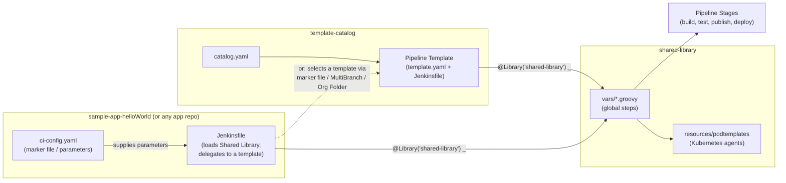

# Pipeline Training 2026

This organization hosts the sample repositories for a **CloudBees CI / Jenkins Pipeline-as-Code training workshop**. The content walks through building a governed, reusable pipeline platform — starting from a plain Jenkinsfile and ending with application teams onboarding via a one-line marker file.

## What This Training Covers

- **Shared Libraries** — centralizing pipeline logic (build, versioning, JFrog/Jira integration) into reusable global steps instead of copy-pasted Groovy.
- **Pipeline Templates** — packaging opinionated, parameterized pipelines on top of a Shared Library so application teams don't write Jenkinsfiles from scratch.
- **Pipeline Template Catalogs & Marker Files** — letting an application repo select and configure a template declaratively (`ci-config.yaml`), so platform teams keep governance and lifecycle control while developers self-serve.
- **Pipeline mechanics** — Scripted vs. Declarative syntax, Kubernetes agents, parallel execution, checkpoints/restart, and cross-team pipeline events.

## Repositories

| Repository | Purpose |
| --- | --- |
| [`shared-library`](https://github.com/pipeline-training-ws/shared-library) | Jenkins Shared Library: reusable global steps (`buildMaven`, `newSemanticVersion`, `jfrogUploadArtifact`, `jiraCreateIssue`, …), the `pipelineTemplateHelloWorld` pipeline template, and Kubernetes pod templates. The foundation every other repo builds on. |
| [`template-catalog`](https://github.com/pipeline-training-ws/template-catalog) | A CloudBees CI **Pipeline Template Catalog** (`catalog.yaml` + `templates/`). Each template is a thin Jenkinsfile that loads `shared-library` and delegates the real logic to it. |
| [`sample-app-helloWorld`](https://github.com/pipeline-training-ws/sample-app-helloWorld) | A minimal "application" repo showing what a team actually commits: a `Jenkinsfile` that loads the Shared Library, and a `ci-config.yaml` marker file supplying its own parameters. |
| [`pipeline-samples`](https://github.com/pipeline-training-ws/pipeline-samples) | Focused, standalone pipeline recipes: checkpoints/restart-from-stage, cross-team `publishEvent`/`eventTrigger`, parallel Kubernetes agent patterns, and JFrog/Jira integration walkthroughs. Also includes the Scripted-vs-Declarative comparison and recommendation guide. |

## High-Level Templating Approach

The training's core idea: application repos stay tiny (a marker file + a one-line Jenkinsfile), while all real pipeline logic and governance live centrally in the Shared Library and Template Catalog.



**Why this shape:** platform teams change pipeline behavior once in `shared-library` (or ship a new `template-catalog` entry) and every consuming repo picks it up on next run — without editing dozens of individual Jenkinsfiles. Application teams only ever touch their own marker file and parameters.

---

### Comparison: Scripted vs. Declarative Jenkins Pipelines

| Feature / Aspect | Scripted Pipeline | Declarative Pipeline |
| --- | --- | --- |
| **Syntax Style** | Groovy-based imperative programming code. | Structured, domain-specific language (DSL) with predefined block keywords. |
| **Learning Curve** | **Steep** — Requires solid knowledge of Groovy syntax, control logic, and Jenkins internals. | **Gentle** — Easy to learn, read, and maintain for developer and DevOps teams alike. |
| **Flexibility & Control** | **Unlimited** — Full access to Groovy features (loops, functions, complex condition logic, try-catch). | **Restricted** — Bounded by strict syntax block constraints; requires `script {}` blocks for custom Groovy. |
| **Structure & Readability** | Harder to standardize; code can quickly turn into complex "spaghetti" logic if unmanaged. | Highly structured and predictable (`pipeline`, `agent`, `stages`, `stage`, `steps`, `post`). |
| **Error Handling** | Programmatic via traditional `try / catch / finally` blocks. | Built-in declarative `post` conditions (`always`, `success`, `failure`, `changed`, `unstable`). |
| **Validation & Linting** | Standard Groovy syntax check; logic errors often only surface at runtime. | Validated before execution via Jenkins Linter API and VS Code Jenkins extensions. |
| **Blue Ocean / Visualization** | Minimal native layout support; stages may not render visually if generated dynamically. | Native support for Jenkins Blue Ocean visualization and stage progression graphics. |
| **Parallel Execution** | Expressed using custom `parallel` map constructs and Groovy closures. | Declarative `parallel` block syntax built into stages. |

---

### Recommendations: When to Use Which and Why

```
                 Do you need complex Groovy logic, dynamic stage generation,
                 or support for legacy Groovy-based pipeline code?
                                       / \
                                      /   \
                                YES  /     \  NO
                                    /       \
                         [ Scripted ]       [ Declarative ]
                         (Imperative)        (Standard / Default)

```

#### Choose **Declarative Pipeline** (Recommended Default)

- **When:**
- Setting up standard CI/CD workflows for microservices, standard Web applications, or modern containers (Kubernetes pod templates).
- Onboarding new developers or cross-functional teams who need to edit pipeline configurations without knowing Groovy.
- Building pipelines that follow standard stages: `Checkout` → `Build` → `Test` → `Lint` → `Deploy`.

- **Why:**
- **Maintainability & Governance:** Standardized syntax keeps pipeline definitions predictable across dozens or hundreds of repositories.
- **Fewer Runtime Surprises:** Jenkins validates Declarative syntax before executing the job steps, catching simple syntax mistakes instantly.
- **Built-in Features:** Simplifies agent provisioning, environment variable handling, credentials management, and clean post-build notification handling without boilerplate code.

---

#### Choose **Scripted Pipeline**

- **When:**
- Building highly dynamic workflows where stages must be programmatically generated at runtime (e.g., iterating over a dynamic matrix generated from an external API payload).
- Refactoring legacy Jenkins pipelines heavy on custom Groovy classes, helper functions, and intricate multi-level try-catch error recovery loops.
- Developing advanced Shared Libraries that require low-level Jenkins API interaction.

- **Why:**
- **Unrestricted Expressiveness:** Provides the full power of a programming language rather than a constrained configuration DSL.
- **Dynamic Execution:** Enables complex looping, conditional execution, and multi-branch execution flows that are impossible or awkward to represent in Declarative blocks without nesting `script {}` overrides.

---

## Documentation & Videos

### Pipeline Best Practices

- 📝 [Just Enough Pipeline](https://www.jenkins.io/blog/2021/10/26/just-enough-pipeline/)
- 📘 [CloudBees CI Pipeline Best Practices](https://docs.cloudbees.com/docs/cloudbees-ci/latest/pipelines/pipeline-best-practices)
- 🎥 [Scripted vs. Declarative Pipelines – YouTube](https://www.youtube.com/watch?v=GJBlskiaRrI=)
- 🧠 [Scripted vs. Declarative - Blog](https://e.printstacktrace.blog/jenkins-scripted-pipeline-vs-declarative-pipeline-the-4-practical-differences/)
- 🎥 [Pipeline Templates with Shared Libraries](https://www.jenkins.io/blog/2017/10/02/pipeline-templates-with-shared-libraries/)

### Multibranch Pipelines

- 🎥 [How to Create a GitHub Multibranch Pipeline – YouTube](https://www.youtube.com/watch?v=ZWwmh4gqia4)
- 📘 [CloudBees Docs: Multibranch Pipelines](https://docs.cloudbees.com/docs/cloudbees-ci/latest/pipelines/pipeline-as-code#_multibranch_pipeline_projects)

### Template Catalogs

- 🎥 [Pipeline Template Catalogs – YouTube](https://www.youtube.com/watch?v=pPwI_kTSCmA)
- 📘 [Pipeline Template Catalogs Docs](https://docs.cloudbees.com/docs/cloudbees-ci/latest/pipeline-templates-user-guide/)

### Organization Folders

- 🎥 [Create GitHub Org Folder – YouTube](https://www.youtube.com/watch?v=w5YupbQ1vHI)
- 📘 [CloudBees Docs: Org Folders](https://docs.cloudbees.com/docs/cloudbees-ci/latest/pipelines/pipeline-as-code#_organization_folders)

### Marker Files

- 📘 [Marker Files](https://docs.cloudbees.com/docs/cloudbees-ci/latest/pipelines/pipeline-as-code#custom-pac-scripts)

### GitHub App Authentication

- 🔐 [Using GitHub App Authentication](https://docs.cloudbees.com/docs/cloudbees-ci/latest/traditional-admin-guide/github-app-auth)

### CloudBee Properitary Pipeline features

- 📘 [CloudBees CI Pipeline Benefits](https://docs.cloudbees.com/docs/cloudbees-ci/latest/pipelines/pipeline-benefits)
